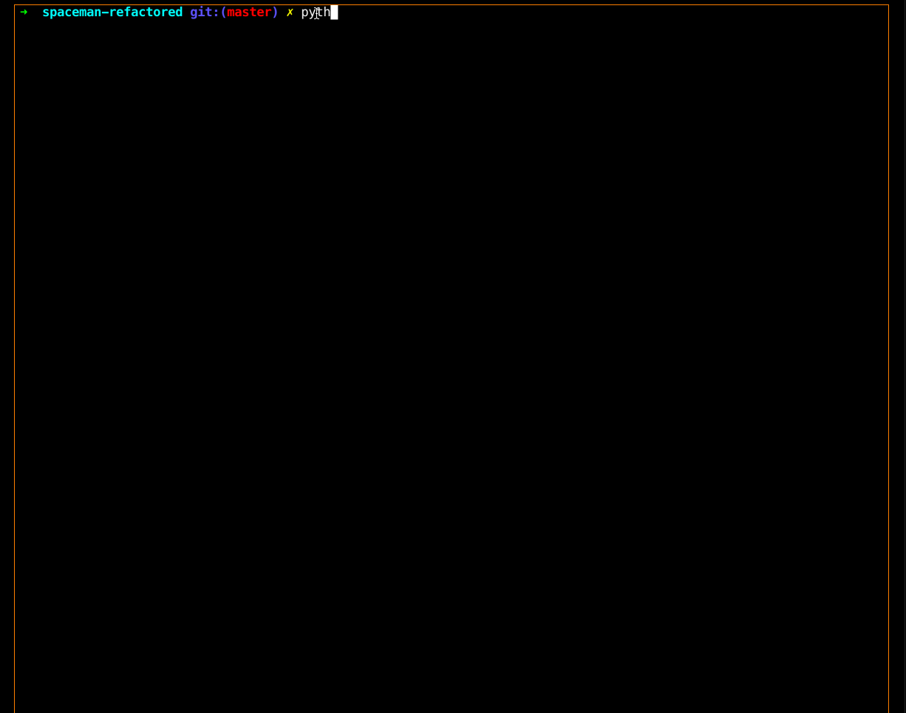

# Spaceman 

**Spaceman** is word guessing game written in python.

## User Stories
* [X] Users can guess letters
* [X] Users can see how many chances they have
* [X] Users can see the process of rocket building
* [X] Users can be notified when repeated input is made
* [X] Users can be notified when non alphabetic input is made 

## Video Demo
